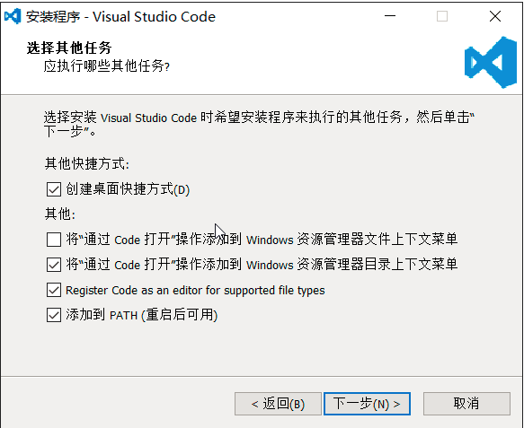

# learn-javascript
JavaScript全栈教程参考源码

[源代码](https://github.com/michaelliao/learn-javascript.git)

## 源博客地址

[廖雪峰的博客](https://www.liaoxuefeng.com/wiki/001434446689867b27157e896e74d51a89c25cc8b43bdb3000/001470969077294a6455fc9cd1f48b69f82cd05e7fa9b40000)

## 代码的IDE

这里代码使用的是 Visual Studio Code 作为IDE。

安装Visual Studio Code
可以从Visual Studio Code的[官方网站](https://code.visualstudio.com/)下载并安装最新的1.4版本。网速慢的童鞋请移步[国内镜像](https://pan.baidu.com/s/1kU5OCOB#list/path=%2Fpub%2Fvscode)。

安装时注意：勾选上右键快捷访问的设置！

安装过程中，请务必钩上以下选项：

